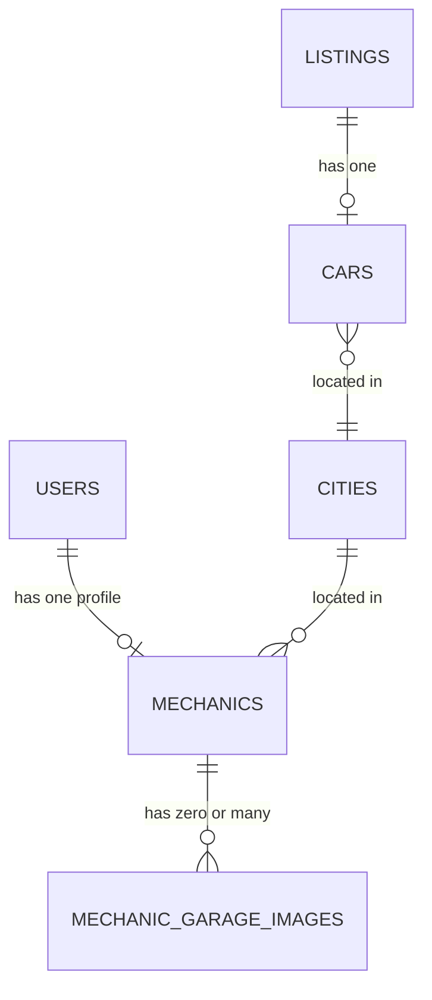

# Data Model: Mechanics Directory & Listing-Based Discovery

## Overview

Two new tables extend the existing schema: `mechanics` (one profile per mechanic user) and `mechanic_garage_images` (zero-or-many photos per profile). Both reuse existing reference tables (`users`, `cities`) rather than duplicating data.

## Entities

### Mechanic (table: `mechanics`)

| Column              | Type             | Constraints                                         | Notes                                                |
| ------------------- | ---------------- | --------------------------------------------------- | ---------------------------------------------------- |
| `id`                | integer          | PK, identity                                        |                                                      |
| `user_id`           | integer          | NOT NULL, UNIQUE, FK → `users.id` ON DELETE CASCADE | Enforces one profile per mechanic account            |
| `name`              | varchar          | NOT NULL                                            | Public display/business name                         |
| `city_id`           | integer          | NOT NULL, FK → `cities.id`                          | Drives listing-based discovery matching              |
| `address`           | varchar          | NOT NULL                                            | Street-level address, display-only in v1             |
| `latitude`          | double precision | NOT NULL, CHECK (`latitude` BETWEEN -90 AND 90)     | Physical location, required                          |
| `longitude`         | double precision | NOT NULL, CHECK (`longitude` BETWEEN -180 AND 180)  | Physical location, required                          |
| `description`       | varchar          | NULL                                                | Optional bio/description                             |
| `phone`             | varchar          | NULL                                                | Optional contact number                              |
| `inspection_price`  | integer          | NULL                                                | Optional, informational only (no payments)           |
| `profile_image_url` | varchar          | NULL                                                | Object key in the mechanics storage bucket; optional |
| `is_active`         | boolean          | NOT NULL, DEFAULT `true`                            | Controls public visibility (FR-008, FR-009)          |
| `created_at`        | date             | NOT NULL, DEFAULT now()                             |                                                      |
| `updated_at`        | date             | NOT NULL, DEFAULT now()                             |                                                      |

**Indexes**: unique index on `user_id` (also serves as the ownership lookup index); index on `city_id` (discovery query path, per constitution IV).

**Relations**:

- `mechanic.user` → one `users` row (owner).
- `mechanic.city` → one `cities` row.
- `mechanic.garageImages` → many `mechanic_garage_images` rows.

**Validation rules** (Zod, mirrored by DB constraints where noted):

- `name`, `cityId`, `address`, `latitude`, `longitude` required on create.
- `latitude`/`longitude` numeric within valid geographic ranges (also enforced by DB CHECK).
- `description`, `phone`, `inspectionPrice`, `profileImageFilename` optional; `inspectionPrice` must be a non-negative number when present.
- Update accepts a partial set of the same fields (all optional on update), except identity fields (`id`, `userId`) which are never client-writable.

**State transitions**: `is_active` toggles `true ↔ false` only by the owning mechanic (FR-008); no other state machine.

### Garage Image (table: `mechanic_garage_images`)

| Column        | Type    | Constraints                                     | Notes                                      |
| ------------- | ------- | ----------------------------------------------- | ------------------------------------------ |
| `id`          | integer | PK, identity                                    |                                            |
| `mechanic_id` | integer | NOT NULL, FK → `mechanics.id` ON DELETE CASCADE |                                            |
| `link`        | varchar | NOT NULL                                        | Object key in the mechanics storage bucket |
| `created_at`  | date    | NOT NULL, DEFAULT now()                         |                                            |

**Indexes**: index on `mechanic_id` (FK access path, ownership + listing queries).

**Relations**: `mechanicGarageImage.mechanic` → one `mechanics` row.

**Validation rules**: `link`/uploaded filename must match an allowed image extension (reuse existing `getFileType`/`allowedFileTypes` helper, images only — no video, unlike car media).

**Lifecycle**: created via an "add garage image" request (presigned upload, same pattern as car media); deleted individually by the owning mechanic. No update-in-place; a mechanic replaces a photo by deleting and re-adding.

### City _(existing, extended relation only)_

- Add a `mechanics: many(mechanicTable)` relation on `cityRelations` (no column changes) so a city can list its mechanics.

### User _(existing, extended relation only)_

- Add a `mechanic: one(mechanicTable)` relation on `userRelations` (no column changes) so a user can resolve their own mechanic profile.

### Car Listing _(existing, no schema change)_

- Discovery reads `listings.status` and the attached `cars.city_id` (via the existing `listingTable.car` relation) to resolve the target city; no new columns needed.

## Derived / Computed Response Shapes

- **Mechanic public profile response**: `{ id, name, city: { id, name }, address, latitude, longitude, description, phone, inspectionPrice, profileImageUrl (presigned GET URL, or null), isActive, garageImages: [{ id, url (presigned GET URL) }] }`.
- **Mechanic self profile response**: same shape as public, always returned regardless of `isActive`.
- **Listing discovery response**: `{ mechanics: [ <mechanic public profile response>, ... ], meta: { total, page, limit, totalPages } }` (empty `mechanics` array + zeroed `meta` when the listing's city has no active mechanics, the listing isn't `approved`, or no car/city is attached).

## Entity Relationship Summary

